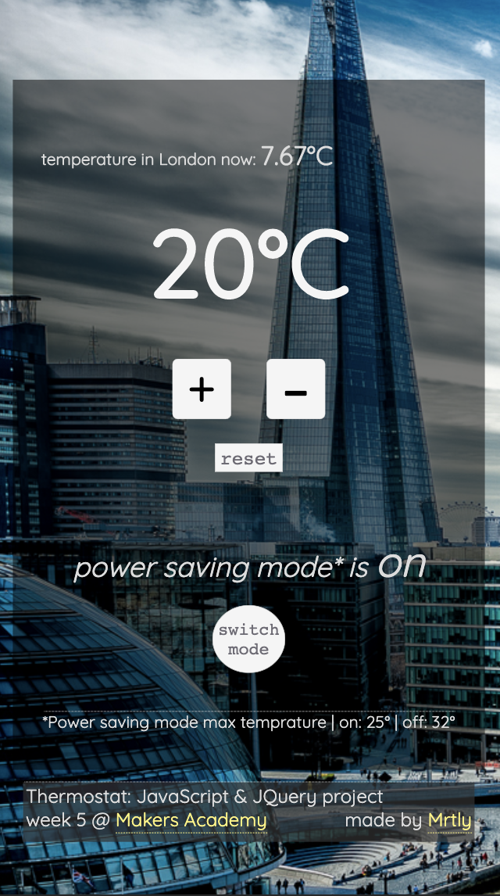

### Thermostat

 
#### The idea
A thermostat app made with JavaScript & JQuery

##### Specification

- [x] Thermostat starts at 20 degrees
- [x] You can increase the temperature with an up function
- [x] You can decrease the temperature with a down function
- [x] The minimum temperature is 10 degrees
- [x] If power saving mode is on, the maximum temperature is 25 degrees
- [x] If power saving mode is off, the maximum temperature is 32 degrees
- [x] Power saving mode is on by default
- [x] You can reset the temperature to 20 with a reset function
- [x] You can ask about the thermostat's current energy usage: < 18 is low-usage, < 25 is medium-usage, anything else is high-usage.
   

#### Built with

JavaScript, with the help of Jasmine

##### Visit

_[thermos.netlify.com](https://thermos.netlify.com/)_

##### View

##### Run

`git clone` this repo, and open index.html in a browser

##### Test

open SpecRunner.html in a browser

##### Notes
Week 5 @ Makers Academy:  
JavaScript : learn a new language and its patterns

#### Collaborators
[Myrtle](https://github.com/Mrtly), [Jason](https://github.com/jasylwong), [Emily](https://github.com/EWright212)

Thank you guys! :)